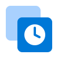
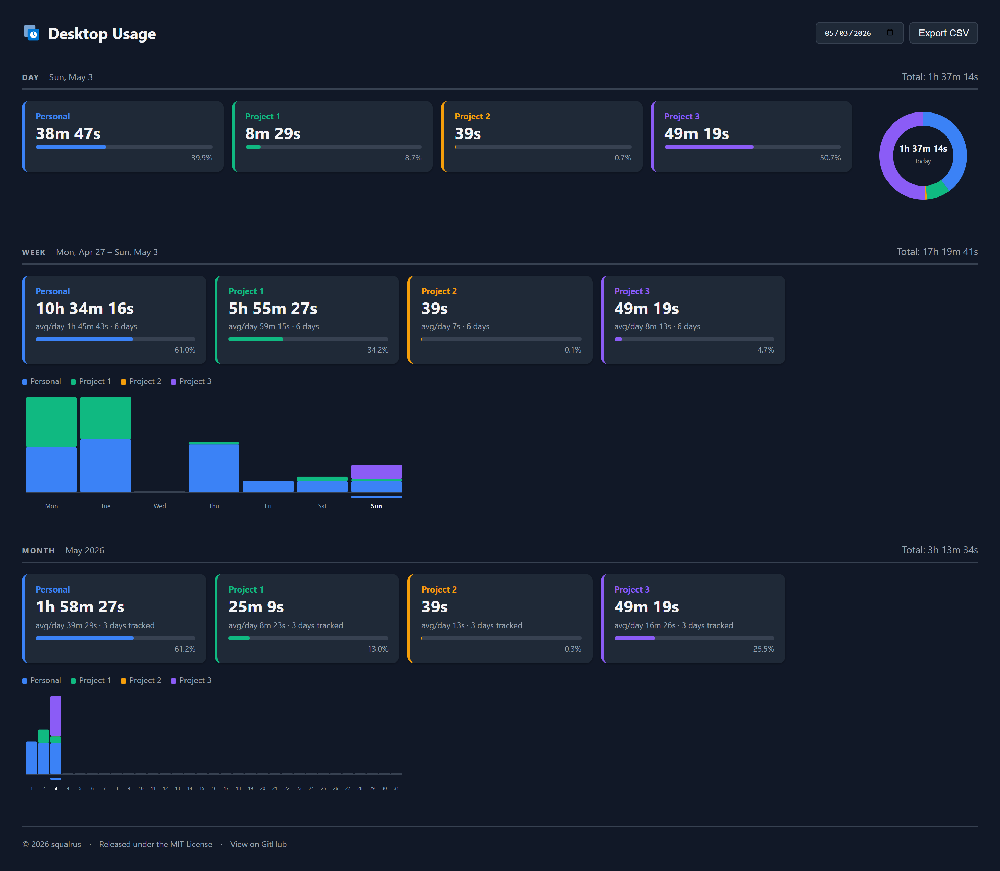

# Windows Virtual Desktop Time Tracker

A lightweight Windows app that quietly tracks how much time you spend on each Virtual Desktop and shows it in a simple browser dashboard. No accounts, no cloud, no subscriptions.

## ✨ Features

- Runs silently in the background from your system tray — no open windows
- Automatically pauses when you step away or lock your computer
- **Day, Week & Month views** — see your desktop time broken down by day, with weekly and monthly totals and daily averages
- **Charts** — donut chart for the day split, stacked bar charts for week and month
- **BambooHR integration** — sync tracked time directly to BambooHR Time Tracking, mapped per desktop to a project
- Export all history to a CSV file with one click
- Automatically matches your Windows light or dark theme

---

## ⚡ Quick Start

1. Go to the [Releases page](../../releases) and download the latest `DesktopTracker-Windows.zip`
2. Unzip and move the folder somewhere writable — e.g. `C:\Users\YourName\DesktopTracker` (**not** `C:\Program Files`, as the app writes its data file alongside the `.exe`)
3. Double-click `DesktopTracker.exe`. A small icon appears near your clock. If Windows shows a security warning, click **More info → Run anyway**
4. Double-click `install_autostart.bat` so the tracker starts automatically every time you log in

Open the dashboard by double-clicking the tray icon, or visit `http://localhost:8000` in any browser.

---

## 📊 Using the Dashboard

The dashboard has three sections — **Day**, **Week**, and **Month** — all driven by the date picker in the top-right corner.

- Use the **date picker** to navigate to any past day
- Each section shows a total, a daily average, and a breakdown per desktop
- **Export CSV** downloads your full history as a spreadsheet

### Syncing to BambooHR

If you use BambooHR for time tracking, the **Sync to BambooHR** button in the Day section submits that day's data directly. See [BambooHR Setup](#-bamboohr-setup) below.

---

## 🔗 BambooHR Setup

The dashboard includes a built-in sync to BambooHR's Daily Totals time tracking. You will need your BambooHR API key and your company's subdomain.

**Get your API key:** In BambooHR, click your profile photo → **API Keys** → **Add New Key**, give it a name, and copy the key immediately — it is only shown once.

**Configure the integration:**

1. Click **⚙** in the top-right of the dashboard
2. Enter your **Company Domain** (the part before `.bamboohr.com`) and **API Key**, then click **Save**
3. Click **Test Connection** — your BambooHR projects load automatically
4. Map each virtual desktop to a project using the dropdowns, then click **Save Mappings**
5. Choose a **Time Rounding** setting (default: 15 minutes)

**Syncing a day:**

Select any day using the date picker, then click **Sync to BambooHR** in the Day section. Desktops without a project mapping are skipped with a warning prompt. Re-syncing a previously submitted day replaces the old entries — no double-counting.

> If your company uses a timesheet approval workflow, synced entries will appear as pending until approved by a manager. Avoid re-syncing days that have already been approved.

---

## 📝 License

This project is open source and available under the [MIT License](LICENSE).
