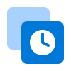
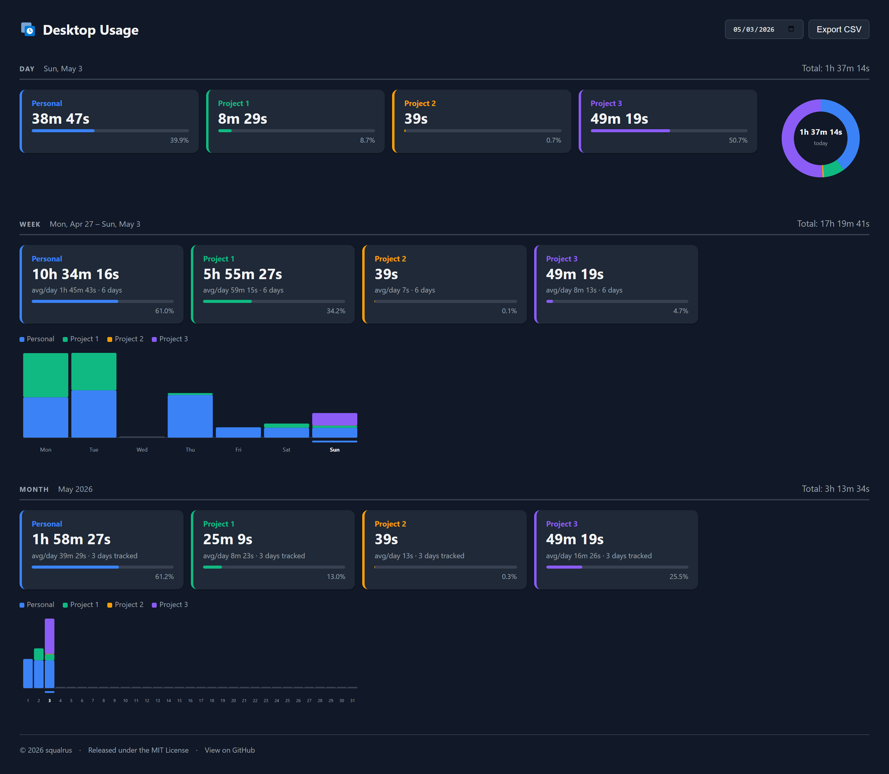

# Windows Virtual Desktop Time Tracker

A lightweight Windows app that quietly tracks how much time you spend on each Virtual Desktop and shows it in a simple browser dashboard. No accounts, no cloud, no subscriptions.

## ✨ Features

- Runs silently in the background from your system tray — no open windows
- Automatically pauses when you step away or lock your computer
- **Day, Week & Month views** — breakdown per desktop with totals, daily averages, and avg/week on month cards
- **Charts** — donut chart for the day split; stacked bar charts for week and month
- **Desktop filter** — scope all three views to one or more desktops simultaneously
- **Hour targets** — set a per-desktop target (daily, weekly, or monthly); the other periods extrapolate automatically. Progress bars appear on every card and in section headers. Optionally exclude weekends from calculations.
- **BambooHR integration** — sync tracked time directly to BambooHR Time Tracking, mapped per desktop to a project
- **Historical data & CSV export** — browse any past day with the date picker; export everything to a spreadsheet with one click
- **Privacy first** — all data is stored locally in `desktop_data.json`. No cloud syncing, no accounts
- **Automatic dark mode** — matches your system or browser theme

---

## ⚡ Quick Start

1. Go to the [Releases page](../../releases) and download the latest `DesktopTracker-Windows.zip`
2. Unzip and move the folder somewhere writable — e.g. `C:\Users\YourName\DesktopTracker` (**not** `C:\Program Files`, as the app writes its data file alongside the `.exe`)
3. Double-click `DesktopTracker.exe`. A small icon appears near your clock. If Windows shows a security warning, click **More info → Run anyway**
4. Double-click `install_autostart.bat` so the tracker starts automatically every time you log in

Open the dashboard by double-clicking the tray icon, or visit `http://localhost:8000` in any browser.

---

## 📊 Using the Dashboard

The dashboard has three sections — **Day**, **Week**, and **Month** — all driven by the date picker in the top-right corner.

- Use the **date picker** to navigate to any past day
- Use the **desktop filter** to focus on one or more desktops across all three views
- Each section shows a total, a daily average, and a breakdown per desktop
- Click the **⚙ gear icon** to open the settings panel — hour targets, time adjustments, CSV export, and BambooHR integration all live here

---

## 🎯 Hour Targets

Click the **⚙** gear icon in the top-right and find the **Hour Targets** section.

1. Choose a period — **Day**, **Week**, or **Month**. The other two extrapolate automatically using a shared daily rate.
2. Enter a target value next to each desktop you want to track (leave blank to skip that desktop).
3. Optionally check **Exclude weekends** to remove Saturday/Sunday from averages and progress calculations.
4. Click **Save**.

Progress bars on each card show how close that desktop is to its own target — blue while in progress, green when met. Section headers show a combined bar across all targeted desktops. A dashed reference line on the bar charts marks the daily target level.

---

## ✏️ Adjust Time

If a chunk of time was tracked against the wrong desktop, you can move it without stopping the tracker.

1. Click **⚙** in the top-right and find the **Adjust Time** section
2. Pick the **Date**, **From** desktop, **To** desktop, and **Minutes**
3. Click **Move**

The change is applied immediately to the running tracker's in-memory data, so it survives the next disk flush. Refuses transfers where the From desktop doesn't have enough tracked time on that date.

---

## 🔗 BambooHR Integration

The dashboard can sync tracked time directly to BambooHR's Daily Totals time tracking. You will need your BambooHR API key and your company's subdomain.

**Get your API key:** In BambooHR, click your profile photo → **API Keys** → **Add New Key**, give it a name, and copy the key immediately — it is only shown once.

**Configure the integration:**

1. Click **⚙** in the top-right of the dashboard
2. Enter your **Company Domain** (the part before `.bamboohr.com`) and **API Key**, then click **Save**
3. Click **Test Connection** — your BambooHR projects load automatically
4. Map each virtual desktop to a project using the dropdowns, then click **Save Mappings**
5. Choose a **Time Rounding** setting (default: 15 minutes)

**Syncing a day:**

Select any day using the date picker, then click **Sync to BambooHR** in the Day section. Desktops without a project mapping are skipped with a warning. Re-syncing a day replaces the previous entries — no double-counting.

> If your company uses a timesheet approval workflow, synced entries will appear as pending until approved by a manager. Avoid re-syncing days that have already been approved.

---

## 🛠️ How It Works

| File | Purpose |
| --- | --- |
| `tracker.py` | Main script. Spawns a tracking thread and an HTTP server thread, then runs the system tray icon on the main thread. All BambooHR API calls are proxied through this server. |
| `index.html` | Static dashboard served locally. Renders day, week, and month views with SVG charts, a desktop filter, per-desktop hour targets, and a BambooHR sync button. All rendering is client-side. |
| `desktop_data.json` | Date-keyed JSON storing tracked seconds per desktop. Written every 5 seconds. Created automatically on first run. |
| `bamboohr_config.json` | BambooHR credentials, desktop→project mappings, time rounding preference, and sync history. Created when settings are first saved. |
| `install_autostart.bat` | Writes a `.vbs` launcher to the Windows Startup folder so `DesktopTracker.exe` starts silently on login. |
| `icon.png` / `icon.ico` | App icons. `icon.png` is loaded first for the system tray (RGBA transparency); `icon.ico` is the fallback. `icon.png` is also the browser tab favicon. |
| `.github/workflows/build.yml` | GitHub Actions workflow that builds `DesktopTracker.exe` via PyInstaller on every push to `main` and publishes a GitHub Release. |

---

## 🤝 Contributing

Contributions, issues, and feature requests are welcome. See [CONTRIBUTING.md](CONTRIBUTING.md) for architecture details, how to run from source, and build pipeline notes. Check the [issues page](../../issues) before opening a new one.

See [CHANGELOG.md](CHANGELOG.md) for a full history of changes.

## 📝 License

This project is open source and available under the [MIT License](LICENSE).
